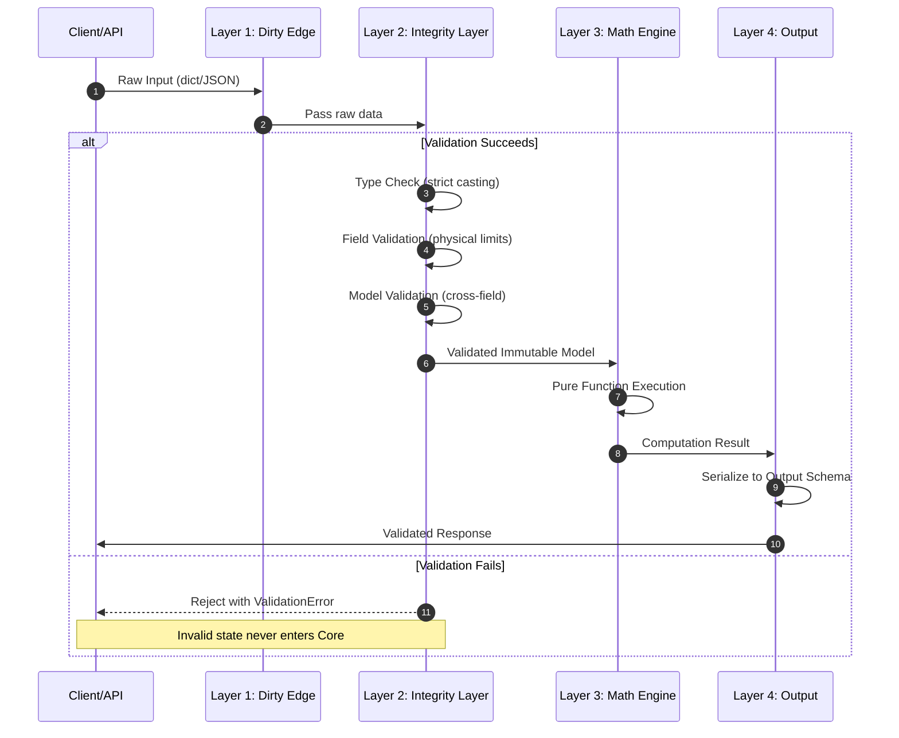
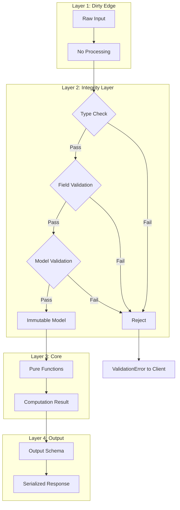

# Vaak Architecture

## Overview

Vaak implements a **Diamond Gate Protocol** - a strict four-layer architecture designed around the principle of **"Correctness by Construction"**. The core philosophy is **"Parse, Don't Validate"**: we do not check data after ingestion; we parse it into strictly typed structures at the very edge. If data cannot form a valid Model, it is rejected immediately.

**No invalid state is ever representable in the Core layer.**

---

## The Four Layers

### Layer 1: The Dirty Edge (Ingestion)

The entry point for all raw, untrusted input.

- **Accepts**: Dictionaries, JSON, environment variables, API payloads
- **Constraint**: No business logic allowed here
- **Responsibility**: Pass raw data to Layer 2 immediately

### Layer 2: The Integrity Layer (The Gatekeeper)

The critical validation boundary using Pydantic V2.

- **Technology**: Pydantic V2 with `ConfigDict(strict=True, frozen=True)`
- **Pattern**: All inputs converted to immutable Pydantic Models immediately
- **Strict Typing**: Never use bare `float` or `int`. Use `Annotated` types with physical constraints

**Multi-Stage Validation**:

1. **Type Check**: Strict casting (reject strings that look like integers)
2. **Field Validation**: Check individual physical limits (e.g., Amplitude < 1.0)
3. **Model Validation**: Cross-field consistency via `@model_validator(mode='after')`

### Layer 3: The Core (Math Engine)

Pure, stateless mathematical functions.

- **Input**: Accepts ONLY validated Models from Layer 2
- **Logic**: Implements mathematical formulas
- **Constraint**: No I/O, no prints, no database calls - just math

### Layer 4: Output and Storage

Serialization and persistence layer.

- **Responsibility**: Serialize results into validated output schemas
- **Pattern**: All outputs are also Pydantic Models

---

## Diamond Gate Protocol - Sequence Diagram



---

## Data Flow Diagram



---

## Module Structure

```
src/vaak/
    __init__.py
    config.py              # Pydantic Settings (Environment)
    
    integrity/             # THE GATEKEEPER
        __init__.py
        schemas.py         # Strict Pydantic Models
        validators.py      # Reusable validator logic
    
    core/
        __init__.py
        math_engine.py     # PURE FUNCTIONS ONLY
```

---

## Key Design Principles

### 1. Immutability by Default

All validated models use `frozen=True`. Once data passes through the Integrity Layer, it cannot be mutated. This eliminates an entire class of bugs related to state changes.

### 2. Strict Type Enforcement

```python
# WRONG: Allows coercion
value: float

# CORRECT: Physical constraint at type level
value: Annotated[float, Field(gt=0, allow_inf_nan=False)]
```

### 3. Fail Fast at the Edge

Invalid data is rejected at Layer 2, before it can propagate to the Core. This means:

- No defensive programming in the Core
- No null checks in mathematical functions
- No "impossible state" handling

### 4. Pure Functions in Core

The Math Engine contains only pure functions:

- Same input always produces same output
- No side effects
- No I/O operations
- Trivially testable and parallelizable

---

## Error Handling Strategy

Errors are categorized by layer:

| Layer | Error Type | Handling |
|-------|-----------|----------|
| Layer 1 | Transport errors | Retry or reject connection |
| Layer 2 | `ValidationError` | Return structured error to client |
| Layer 3 | None expected | If error occurs, it is a design bug |
| Layer 4 | Serialization errors | Log and return internal error |

---

## References

- [Pydantic V2 Documentation](https://docs.pydantic.dev/latest/)
- [Parse, Don't Validate](https://lexi-lambda.github.io/blog/2019/11/05/parse-don-t-validate/)
